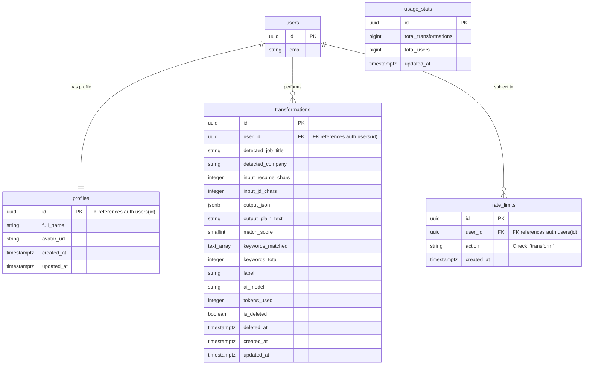
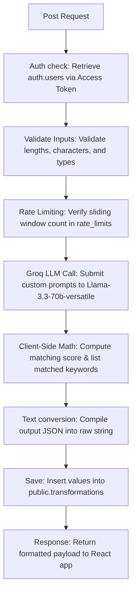

# ResumOrph Project Documentation & Architectural Details

ResumOrph is a premium, AI-powered **ATS (Applicant Tracking System) Resume Tailoring System** designed to bridge the gap between candidate resumes and specific job descriptions. By utilizing Deno Edge Functions, Supabase PostgreSQL databases, Groq AI LLM models, and complex client-side PDF/DOCX parsing and generation, the application optimizes resumes for ATS parsing, content formatting, and keyword alignment.

---

## 🛠️ 1. Technical Stack & Libraries

### Frontend Core & Build
- **React 19 (`react` & `react-dom`):** Leveraging React 19's state synchronization and rendering enhancements.
- **Vite (`vite`):** Modern frontend tooling providing fast Hot Module Replacement (HMR) and optimized build steps.
- **React Router DOM v7 (`react-router-dom`):** Configured with clean client-side routing, protected auth routes, and route parameters.
- **Tailwind CSS v4 (`tailwindcss` & `@tailwindcss/vite`):** Utility-first styling integrated natively into Vite, utilizing CSS-variable-based theme tokens.
- **Framer Motion (`framer-motion`):** Powering micro-animations, fade-in transitions, and slide-up layout entry states.
- **Lucide React (`lucide-react`):** Premium SVG icons utilized throughout the navbar, sidebars, metrics, and actions.
- **Sonner (`sonner`):** Toast notification engine displaying clean, transient status popups (e.g., updates, failures, clipboard copies).

### AI & Backend Services
- **Groq Llama-3.3-70b-versatile:** Deep-learning LLM that parses input materials, extracts sections, and rewrites bullet points structure.
- **Supabase Cloud Suite (`@supabase/supabase-js`):**
  - **Supabase Authentication:** Secure email/password login, signup, password resets, and session management.
  - **Supabase Database (PostgreSQL):** Stores profiles, rate limits, history, and usage statistics.
  - **Deno Edge Functions:** Serverless JavaScript/TypeScript handlers for auth-verified operations, rate-limiting counters, and Groq API calls.
  - **Row Level Security (RLS):** Strict DB policies limiting CRUD operations to the respective authenticated user.

### Parsers & Generators (Client-Side)
- **PDF.js (`pdfjs-dist`):** Lazy-loaded library that parses binary PDF file data, extracts text layouts, and translates them back to clean text.
- **Mammoth (`mammoth`):** Lazy-loaded library that extracts raw plain text from Microsoft Word documents (`.docx`).
- **jsPDF (`jspdf`):** Client-side PDF layout generator that constructs standard executive, modern, tech, or classic Times New Roman formatted documents from structured JSON schemas.

---

## 📂 2. Folder Structure & File Map

Below is the complete tree layout of the ResumOrph codebase with detailed file descriptions:

```text
ResumeCustomizer/
├── .env                          # Local credentials (Supabase URL, API Keys)
├── .gitattributes                # Git settings
├── .gitignore                    # Local file exclude configurations
├── README.md                     # Default project template readme
├── package.json                  # Dependencies, scripts, and dev tools metadata
├── package-lock.json             # Locked package dependency tree
├── vercel.json                   # Vercel routing rules & public SPA fallback configuration
├── vite.config.js                # Vite alias configurations & lazy-load bundle exemptions
├── eslint.config.js              # ESLint rules and syntax checking guidelines
├── index.html                    # Main HTML shell containing CSS injection ports
├── public/                       # Static public assets (icons, logo images, fonts)
│
├── supabase/                     # Supabase Backend Configuration
│   ├── config.toml               # Supabase project CLI settings
│   ├── migrations/               # PostgreSQL Database Migrations
│   │   ├── 001_initial_schema.sql  # Creates tables (profiles, transformations, rate_limits, usage_stats)
│   │   ├── 002_indexes.sql         # Compound, partial, and GIN indexes
│   │   ├── 003_rls.sql             # Row Level Security (RLS) policies
│   │   ├── 004_functions.sql       # SQL trigger functions (new users, update timestamps, soft-deletes)
│   │   └── 005_fix_safe_updates.sql# SQL updates safety overrides
│   └── functions/                # Deno Serverless Edge Functions
│       ├── _shared/              # Shared helper modules for serverless execution
│       │   ├── auth.ts           # Access token extraction and user identification
│       │   ├── cors.ts           # Global cross-origin headers (CORS)
│       │   ├── groq.ts           # Groq endpoint caller, structured system prompts, and model parameters
│       │   ├── matchScore.ts     # Server-side token matching logic
│       │   ├── rateLimit.ts      # Database-driven sliding-window checks
│       │   └── resumeToText.ts   # Plain-text converters for output_plain_text representation
│       ├── cleanup/              # Edge Function: auto-cleaning job for rate limits
│       └── transform/            # Edge Function: central AI pipeline executing resume optimization
│
└── src/                          # Frontend Application Code
    ├── main.jsx                  # Application mounting entrypoint
    ├── App.jsx                   # Central React Router setup & global ErrorBoundary
    ├── assets/                   # Local images, SVG icons, and animation files
    ├── contexts/                 # React Context State Providers
    │   └── AuthContext.jsx       # Supabase Session listener & global auth status provider
    ├── hooks/                    # Reusable React hooks
    │   ├── useAuth.js            # Accesses AuthContext authentication functions
    │   ├── useDocumentTitle.js   # Dynamically updates the browser tab title
    │   ├── useHistory.js         # Handles dashboard transformations history, stats, and pagination
    │   └── useTransform.js       # Manages wizard states, error handling, scoring, and auto-retries
    ├── lib/                      # Base integrations and layout rendering
    │   ├── api.js                # API wrapper mapping client-side requests to Supabase and Edge Functions
    │   ├── pdfGenerator.js       # Compiles structured JSON data into custom PDF templates (Classic, Modern, Tech, Executive)
    │   ├── supabase.js           # Supabase client instance initializer
    │   └── parsers/
    │       └── fileParser.js     # Parses .pdf (via pdfjs-dist), .docx (via mammoth), and .txt client-side
    ├── styles/
    │   └── globals.css           # Global custom classes, Tailwind imports, variables, scrollbar overlays
    ├── utils/
    │   ├── constants.js          # Shared variables (templates, page-budgets, stop-words)
    │   ├── formatDate.js        # Helper to output user-friendly dates
    │   ├── matchScore.js         # Client-side ATS matching score math, keywords and missing list logic
    │   ├── resumeToText.js       # Converts structured CV JSON objects back to standard string text
    │   └── scoreColor.js         # Dynamic color helper based on score thresholds (Red, Yellow, Green)
    ├── pages/                    # React page views
    │   ├── Landing.jsx           # Landing page featuring hero, live comparison animation, pricing cards, and FAQs
    │   ├── Login.jsx             # Auth form: sign-in panel
    │   ├── Signup.jsx            # Auth form: sign-up panel
    │   ├── ForgotPassword.jsx    # Auth form: triggers recovery emails
    │   ├── ResetPassword.jsx     # Auth form: password override
    │   ├── VerifyEmail.jsx       # Auth form: email validation landing
    │   ├── Dashboard.jsx         # User dashboard containing user stats, history search, and entry pathways
    │   ├── Transform.jsx         # Step-by-step optimization wizard (Upload -> Job Input -> Processing -> Output)
    │   ├── TransformDetail.jsx   # Past transformation viewer (loads old outputs into the Workspace layout)
    │   ├── Profile.jsx           # User details edit page
    │   └── NotFound.jsx          # Custom 404 page
    └── components/               # Sub-component layouts
        ├── dashboard/            # Components for user dashboard
        │   ├── StatsRow.jsx            # Displays summary cards of user's optimization counts and best score
        │   └── TransformationRow.jsx   # Table list row representing a single history session with edit/delete controls
        ├── layout/               # Global skeleton components
        │   ├── Navbar.jsx              # Responsive header containing links, dark theme options, and profile toggles
        │   ├── Footer.jsx              # Common footer structure
        │   └── ProtectedRoute.jsx      # Navigation gate blocking unauthorized guests
        ├── ui/                   # Reusable atomic UI components
        │   ├── Accordion.jsx           # Expandable accordion containers
        │   ├── Button.jsx              # Standard buttons with loading overlays and variant options
        │   ├── Card.jsx                # Layout cards
        │   ├── ErrorBoundary.jsx       # Captures UI crashes and displays custom recovery screens
        │   ├── GlassPanel.jsx          # Glossy translucent background sheets
        │   ├── Input.jsx               # Input fields
        │   ├── LoadingSpinner.jsx      # Spinner animations
        │   ├── Modal.jsx               # Centered popup dialog boxes
        │   ├── PremiumModal.jsx        # Premium lock overlays
        │   ├── Tabs.jsx                # Tab navigation headers
        │   └── Textarea.jsx            # Resizable multi-line text input fields
        └── transform/            # Workspace and Optimizer specific components
            ├── ResumeCompare.jsx       # Side-by-side view comparing original plain text and optimized preview
            ├── ResumePreview.jsx       # Translates structured JSON back to matching HTML styles representing standard PDF templates
            ├── ScoreDisplay.jsx        # Progress wheel displaying the calculated score
            ├── TransformOutput.jsx     # Workbench linking sidebar tabs, styling configs, and tab layouts
            ├── wizard/                 # Sub-elements for wizard
            │   ├── FileDropzone.jsx    # Drag-and-drop file upload zone
            │   ├── JobInput.jsx        # Text box area for Target Job Description input
            │   ├── ResumeInput.jsx     # Combines FileDropzone and raw text editor for original resume entry
            │   └── TransformLoading.jsx# Animated processing screen showing serverless AI execution
            ├── workspace/              # Sub-components inside the Output panel
            │   ├── ScoreBanner.jsx     # Dashboard banner displaying scores, titles, and download action triggers
            │   ├── StyleControlPanel.jsx # Design presets (Classic, Modern, Tech, Executive) and page-budgeting buttons
            │   ├── TransformErrorPanel.jsx # Detailed error panels displaying rate limits or timeouts
            │   └── WorkspaceSidebar.jsx# Sidebar layout housing the workbench navigation tabs
            └── tabs/                   # Tab page views for Workbench
                ├── AtsCheckTab.jsx     # Renders ATS details, keyword matrices, formatting risks, and next steps
                ├── CoverLetterTab.jsx  # AI-generated Cover Letter review panel with download and copy features
                ├── InterviewTab.jsx    # Custom Interview preparation questions (Technical, Behavioral, Curveball)
                ├── JdMatchTab.jsx      # Direct requirement checklist alignment view
                ├── OverviewTab.jsx     # Main overview tab showing scores, density, headings, and metadata
                ├── RecruiterTab.jsx    # Displays Attention Timeline (1, 2, 3), pile sorting, and elevator pitch
                ├── RescoreTab.jsx      # Sliders to adjust priority weights and re-run compatibility calculations
                ├── RewritesTab.jsx     # Before/After diff comparison list displaying the specific changes made
                ├── RoadmapTab.jsx      # Interactive milestone checklist displaying the path to "Top Tier"
                └── SkillsTab.jsx       # Core skill match analysis and a custom bar chart displaying categorizations
```

---

## 🗄️ 3. Database Schema & Data Model

The application utilizes Supabase (PostgreSQL) with a relational structure optimization. Five SQL scripts configure the initial schema, indexes, security policies, and automation triggers.

### Database Tables



1. **`public.profiles`**: Extends the default Supabase `auth.users` authentication metadata (stores names, avatars, and timestamps).
2. **`public.transformations`**: The primary data table. Each entry stores a finalized AI-generated resume inside `output_json` (including nested education, experience, and custom sections), the parsed target job details, calculated metrics, and custom label strings.
3. **`public.rate_limits`**: Stores a rolling action-log to control and limit API request frequency.
4. **`public.usage_stats`**: A single-row global statistics table housing total transformations and user counts, utilized for landing page counters.

---

### Database Triggers & Stored Functions

- **`public.handle_new_user()`**: Fired `AFTER INSERT` on `auth.users`. Automatically synchronizes metadata into `public.profiles`.
- **`public.increment_user_count()`**: Fired `AFTER INSERT` on `auth.users`. Increments the user counter inside the single row of `public.usage_stats`.
- **`public.increment_transformation_count()`**: Fired `AFTER INSERT` on `public.transformations`. Increments the transformation counter inside `public.usage_stats`.
- **`public.handle_updated_at()`**: Automatically resets the `updated_at` column to `NOW()` when update transactions run on `profiles` or `transformations`.
- **`public.soft_delete_transformation(p_id, p_user_id)`**: Handles soft-deletes by setting `is_deleted = TRUE` and `deleted_at = NOW()`, maintaining record history.
- **`public.cleanup_old_rate_limits()`**: Clears entries from `public.rate_limits` that are older than 2 hours to keep the table size optimized.

---

### 🛡️ Row Level Security (RLS) Policies

Row Level Security is enabled across all tables:
- **`profiles`**: Select, Insert, and Update rules restrict access using `auth.uid() = id`.
- **`transformations`**: Select, Insert, and Update policies are restricted using `auth.uid() = user_id`. Access is blocked if `is_deleted = TRUE`. Real deletions are blocked at the schema level.
- **`rate_limits`**: Controlled by Edge Functions using the bypass-capable database `service_role`. No public policies are open.
- **`usage_stats`**: Reading is open to all users (`USING (TRUE)`) to populate landing page social proof metrics. Writing is locked to the service role.

---

### ⚡ Index Optimization Strategies

To reduce latency, `002_indexes.sql` establishes key indexes:
- **Partial Indexes**: `idx_transformations_user_id`, `idx_transformations_user_created` (sorted by `created_at DESC`), and `idx_transformations_score` index user queries where `is_deleted = FALSE`.
- **Sliding Window Index**: `idx_rate_limits_user_action_time` covers `(user_id, action, created_at DESC)` to enable rapid lookup of recent rate-limiting entries.
- **GIN Index**: `idx_transformations_output_gin` provides quick JSONB searches over the `output_json` properties.

---

## 🤖 4. Serverless Edge Functions & AI Integration

The `transform` edge function runs the central AI pipeline.

### Processing Pipeline Flow


### Prompt Details & Expected JSON Schema
The system prompt enforces Groq to respond in an exact, valid JSON format without markdown wrappers. The expected return structure maps directly to the UI elements:

```json
{
  "contact": {
    "name": "Full Name",
    "email": "email@example.com",
    "phone": "123-456-7890",
    "location": "City, State",
    "linkedin": "linkedin.com/in/username",
    "github": "github.com/username",
    "portfolio": "portfolio.com"
  },
  "summary": "Professional summary optimized with job-specific keywords...",
  "skills": {
    "technical": ["Python", "React", "SQL"],
    "tools": ["Git", "Docker", "AWS"],
    "soft": ["Agile", "Team Leadership"]
  },
  "experience": [
    {
      "company": "Company Name",
      "location": "City, State",
      "title": "Job Title",
      "start_date": "MM/YYYY",
      "end_date": "MM/YYYY/Present",
      "bullets": [
        "Quantifiable achievement including keywords...",
        "Reframed responsibility matching job requirements..."
      ]
    }
  ],
  "education": [
    {
      "institution": "University Name",
      "degree": "Degree",
      "field": "Field of Study",
      "start_year": "YYYY",
      "end_year": "YYYY"
    }
  ],
  "projects": [
    {
      "title": "Project Title",
      "description": "Project overview optimized for keyword matching...",
      "bullets": ["Action-focused achievement detail..."]
    }
  ],
  "recruiter_scan": {
    "attention_timeline": ["Timeline step 1", "Timeline step 2", "Timeline step 3"],
    "strong_yes": "Reason why candidate is a fit...",
    "completely_missed": "Gaps identified in experience...",
    "best_fix": "Single highest-leverage task to address gaps...",
    "elevator_pitch": "30-second introduction pitch..."
  },
  "roadmap": {
    "current_level": "Beginner | Developing | Competitive | Top Tier",
    "tasks": [
      { "task": "Task description", "type": "Project | Course | Certification", "impact": "High Impact | Medium Impact", "points": 10 }
    ]
  },
  "interview_prep": {
    "technical": [
      { "question": "Question text", "difficulty": "Medium | Hard", "expectation": "Interviewer expectations..." }
    ],
    "behavioral": [],
    "curveball": []
  },
  "cover_letter": "AI generated matching cover letter...",
  "meta": {
    "detected_job_title": "Detected Title",
    "detected_company": "Detected Company"
  }
}
```

---

## 📈 5. Client-Side ATS Match Calculation

To ensure matching statistics align perfectly with the UI, the client computes the ATS match score locally using the `computeMatchScore` utility. This calculation is synchronized with the Edge function.

1. **Stop Words Exclusion**: The job description text is stripped of symbols, lowercased, split into words, and filtered against a comprehensive **200+ stop-words dictionary** (e.g., pronouns, common prepositions, and generic business buzzwords like "seek", "seeking", "proven", "ability").
2. **Unique Keyword Extraction**: Standardizes words to a minimum length of 3 characters, removing standalone digits, leaving a list of unique keywords.
3. **Substring Check**: Recursively scans the tailored JSON output text properties. Keywords present in the text are classified as `matched`, while missing ones form the `missing` keywords list.
4. **Percentage Formula**: 
   $$\text{Match Score} = \min\left(\left\lfloor\frac{\text{Matched Keywords}}{\text{Total Keywords}} \times 100\right\rfloor, 100\right)$$
5. **Score Healing**: If the locally computed score differs from the database record, the app runs a background transaction (`updateTransformationScore`) to update the database score.

---

## 🎨 6. UI/UX Structure & Navigation Flow

### 🚦 Navigation Map

```text
               [Public Landing Page /]
                         │
         ┌───────────────┴───────────────┐
         ▼                               ▼
     [Sign Up]                       [Log In]
         │                               │
         └───────────────┬───────────────┘
                         ▼
                [Dashboard Gate] (Protected)
                         │
         ┌───────────────┼───────────────┐
         ▼               ▼               ▼
   [Transform Wizard] [Transform Detail] [Profile Settings]
         │
         ▼
    [Workspace Workbench]
```

### 🎛️ The Workspace Workbench Layout

When a transformation succeeds or a past record loads, the user is presented with the **Workspace Workbench** dashboard:

```text
┌────────────────────────────────────────────────────────────────────────┐
│  Navbar (Logo, User Status, Theme Settings)                             │
├────────────────────────────────────────────────────────────────────────┤
│  Score Banner (Job Title, Target Company, Match Score Wheel, Actions)  │
├────────────────────────────────────────────────────────────────────────┤
│  Style Control Panel (Presets, Page Budget, Spacing Configs)           │
├────────────────────────────────────────────────────────────────────────┤
│  Sidebar Tabs       │  Main Content Area                               │
│                     │                                                  │
│  - Overview         │  Renders selected Tab component:                 │
│  - Optimized CV     │                                                  │
│  - Skills Map       │  - Overview: Fit summary and statistics          │
│  - ATS Check        │  - Preview: Multi-template layout viewer         │
│  - Recruiter Scan   │  - Skills: Core categorizations and match charts │
│  - AI Rewrites      │  - ATS: Keyword matched/missing chips            │
│  - Roadmap          │  - Recruiter Scan: Timeline & elevator pitch     │
│  - Interview Prep   │  - Rewrites: Before/After side-by-side diffs     │
│  - Cover Letter     │  - Roadmap: Checklists that update active score  │
│  - Rescore          │  - Interview Prep: Q&A mock prep interface      │
│                     │  - Cover Letter: Generator and download options  │
│                     │  - Rescore: Interactive weight adjustment sliders│
│                     │                                                  │
└─────────────────────┴──────────────────────────────────────────────────┘
```

- **Interactive Templates**: The user can switch between **Classic Serif** (academic Times New Roman), **Obsidian Modern** (contemporary tech hierarchy), **Clean Tech** (monospaced accents), and **Executive Elegant** (centered headers).
- **Page Budgeting**:
  - `Standard`: Natural overflow.
  - `Strict 1-Page Fit`: Compresses font sizes, margins, and vertical offsets using page-fitting logic to constrain content onto a single page block.
- **Dynamic Roadmap Tasks**: Ticking boxes in the checklist updates the active score display. Users can complete tasks to raise their score.
- **Rescore Sliders**: Sliders allow users to tweak weights (e.g., Technical Depth vs. Team/Strategy, Conciseness vs. Detail, Industry Specificity) and re-run compatibility scoring.

---

## ⚙️ 7. Development & Deployment Configuration

### 🚀 Package Script Commands
- `npm run dev`: Runs the local Vite hot-reload server.
- `npm run build`: Compiles the project assets into optimized distribution directories (`/dist`).
- `npm run lint`: Runs ESLint configurations.
- `npm run preview`: Previews the compiled distribution build.

### 🌐 Vercel SPA Fallback Configuration
To support clean client-side routing on reload, `vercel.json` maps incoming routes to the main index file:
```json
{
  "cleanUrls": true,
  "rewrites": [
    { "source": "/(.*)", "destination": "/index.html" }
  ]
}
```

### ⚡ Lazy Loading Optimization
Vite is configured to exclude `pdfjs-dist` from initial chunk generation to minimize initial load weight. The libraries are dynamically imported when the user uploads file types requiring their parsers:
```javascript
// vite.config.js
optimizeDeps: {
  exclude: ['pdfjs-dist']
}
```
